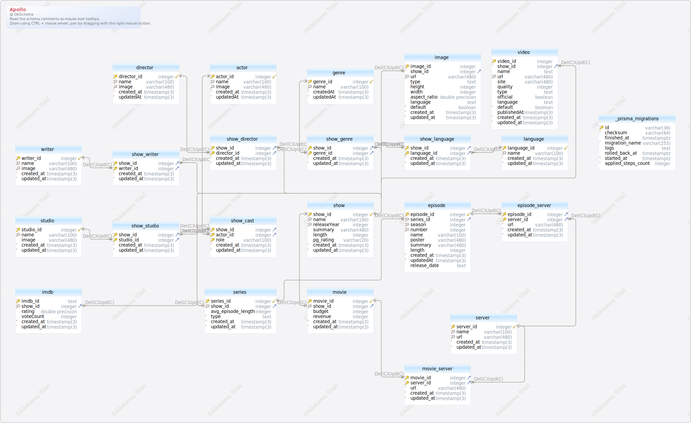

#Apollo

<a name='layout1'>### Layout

### Table _prisma_migrations

| Idx | Field Name | Data Type |
|---|---|---|
| *🔑 | <a name='public._prisma_migrations_id'>id</a>| varchar&#40;36&#41;  |
| *| <a name='public._prisma_migrations_checksum'>checksum</a>| varchar&#40;64&#41;  |
|  | <a name='public._prisma_migrations_finished_at'>finished&#95;at</a>| timestamptz  |
| *| <a name='public._prisma_migrations_migration_name'>migration&#95;name</a>| varchar&#40;255&#41;  |
|  | <a name='public._prisma_migrations_logs'>logs</a>| text  |
|  | <a name='public._prisma_migrations_rolled_back_at'>rolled&#95;back&#95;at</a>| timestamptz  |
| *| <a name='public._prisma_migrations_started_at'>started&#95;at</a>| timestamptz  DEFAULT now() |
| *| <a name='public._prisma_migrations_applied_steps_count'>applied&#95;steps&#95;count</a>| integer  DEFAULT 0 |
| Indexes |
| 🔑 | &#95;prisma&#95;migrations&#95;pkey || ON id|

### Table actor

| Idx | Field Name | Data Type |
|---|---|---|
| *🔑 ⬋ | <a name='public.actor_actor_id'>actor&#95;id</a>| integer  DEFAULT nextval('actor_actor_id_seq'::regclass) |
| *🔍 | <a name='public.actor_name'>name</a>| varchar&#40;100&#41;  |
| 🔍 | <a name='public.actor_image'>image</a>| varchar&#40;480&#41;  |
| *| <a name='public.actor_created_at'>created&#95;at</a>| timestamp&#40;3&#41;  DEFAULT CURRENT_TIMESTAMP |
| *| <a name='public.actor_updatedAt'>updatedAt</a>| timestamp&#40;3&#41;  |
| Indexes |
| 🔑 | actor&#95;pkey || ON actor&#95;id|
| 🔍  | actor&#95;name&#95;image&#95;key || ON name&#44; image|

### Table director

| Idx | Field Name | Data Type |
|---|---|---|
| *🔑 ⬋ | <a name='public.director_director_id'>director&#95;id</a>| integer  DEFAULT nextval('director_director_id_seq'::regclass) |
| *🔍 | <a name='public.director_name'>name</a>| varchar&#40;100&#41;  |
| 🔍 | <a name='public.director_image'>image</a>| varchar&#40;480&#41;  |
| *| <a name='public.director_created_at'>created&#95;at</a>| timestamp&#40;3&#41;  DEFAULT CURRENT_TIMESTAMP |
| *| <a name='public.director_updatedAt'>updatedAt</a>| timestamp&#40;3&#41;  |
| Indexes |
| 🔑 | director&#95;pkey || ON director&#95;id|
| 🔍  | director&#95;name&#95;image&#95;key || ON name&#44; image|

### Table episode

| Idx | Field Name | Data Type |
|---|---|---|
| *🔑 ⬋ | <a name='public.episode_episode_id'>episode&#95;id</a>| integer  DEFAULT nextval('episode_episode_id_seq'::regclass) |
| *🔍 ⬈ | <a name='public.episode_series_id'>series&#95;id</a>| integer  |
| *🔍 | <a name='public.episode_season'>season</a>| integer  |
| *🔍 | <a name='public.episode_number'>number</a>| integer  |
|  | <a name='public.episode_name'>name</a>| varchar&#40;100&#41;  |
|  | <a name='public.episode_poster'>poster</a>| varchar&#40;480&#41;  |
|  | <a name='public.episode_summary'>summary</a>| varchar&#40;480&#41;  |
|  | <a name='public.episode_length'>length</a>| integer  |
| *| <a name='public.episode_created_at'>created&#95;at</a>| timestamp&#40;3&#41;  DEFAULT CURRENT_TIMESTAMP |
| *| <a name='public.episode_updatedAt'>updatedAt</a>| timestamp&#40;3&#41;  |
|  | <a name='public.episode_release_date'>release&#95;date</a>| text  |
| Indexes |
| 🔑 | episode&#95;pkey || ON episode&#95;id|
| 🔍  | episode&#95;number&#95;season&#95;series&#95;id&#95;key || ON number&#44; season&#44; series&#95;id|
| Foreign Keys |
|  | episode_series_id_fkey | ( series&#95;id ) ref [public&#46;series](#series) (series&#95;id) |

### Table episode_server

| Idx | Field Name | Data Type |
|---|---|---|
| *🔑 ⬈ | <a name='public.episode_server_episode_id'>episode&#95;id</a>| integer  |
| *🔑 ⬈ | <a name='public.episode_server_server_id'>server&#95;id</a>| integer  |
| *| <a name='public.episode_server_url'>url</a>| varchar&#40;480&#41;  |
| *| <a name='public.episode_server_created_at'>created&#95;at</a>| timestamp&#40;3&#41;  DEFAULT CURRENT_TIMESTAMP |
| *| <a name='public.episode_server_updated_at'>updated&#95;at</a>| timestamp&#40;3&#41;  |
| Indexes |
| 🔑 | episode&#95;server&#95;pkey || ON server&#95;id&#44; episode&#95;id|
| Foreign Keys |
|  | episode_server_episode_id_fkey | ( episode&#95;id ) ref [public&#46;episode](#episode) (episode&#95;id) |
|  | episode_server_server_id_fkey | ( server&#95;id ) ref [public&#46;server](#server) (server&#95;id) |

### Table genre

| Idx | Field Name | Data Type |
|---|---|---|
| *🔑 ⬋ | <a name='public.genre_genre_id'>genre&#95;id</a>| integer  DEFAULT nextval('genre_genre_id_seq'::regclass) |
| *🔍 | <a name='public.genre_name'>name</a>| varchar&#40;100&#41;  |
| *| <a name='public.genre_createdAt'>createdAt</a>| timestamp&#40;3&#41;  DEFAULT CURRENT_TIMESTAMP |
| *| <a name='public.genre_updatedAt'>updatedAt</a>| timestamp&#40;3&#41;  |
| Indexes |
| 🔑 | genre&#95;pkey || ON genre&#95;id|
| 🔍  | genre&#95;name&#95;key || ON name|

### Table image

| Idx | Field Name | Data Type |
|---|---|---|
| *🔑 | <a name='public.image_image_id'>image&#95;id</a>| integer  DEFAULT nextval('image_image_id_seq'::regclass) |
| *⬈ | <a name='public.image_show_id'>show&#95;id</a>| integer  |
| *🔍 | <a name='public.image_url'>url</a>| varchar&#40;480&#41;  |
|  | <a name='public.image_type'>type</a>| text  |
|  | <a name='public.image_height'>height</a>| integer  |
|  | <a name='public.image_width'>width</a>| integer  |
|  | <a name='public.image_aspect_ratio'>aspect&#95;ratio</a>| double precision  |
|  | <a name='public.image_language'>language</a>| text  |
| *| <a name='public.image_default'>default</a>| boolean  DEFAULT false |
| *| <a name='public.image_created_at'>created&#95;at</a>| timestamp&#40;3&#41;  DEFAULT CURRENT_TIMESTAMP |
| *| <a name='public.image_updated_at'>updated&#95;at</a>| timestamp&#40;3&#41;  |
| Indexes |
| 🔑 | image&#95;pkey || ON image&#95;id|
| 🔍  | image&#95;url&#95;key || ON url|
| Foreign Keys |
|  | image_show_id_fkey | ( show&#95;id ) ref [public&#46;show](#show) (show&#95;id) |

### Table imdb

| Idx | Field Name | Data Type |
|---|---|---|
| *🔑 | <a name='public.imdb_imdb_id'>imdb&#95;id</a>| text  |
| *🔍 ⬈ | <a name='public.imdb_show_id'>show&#95;id</a>| integer  |
|  | <a name='public.imdb_rating'>rating</a>| double precision  |
|  | <a name='public.imdb_voteCount'>voteCount</a>| integer  |
| *| <a name='public.imdb_created_at'>created&#95;at</a>| timestamp&#40;3&#41;  DEFAULT CURRENT_TIMESTAMP |
| *| <a name='public.imdb_updated_at'>updated&#95;at</a>| timestamp&#40;3&#41;  |
| Indexes |
| 🔑 | imdb&#95;pkey || ON imdb&#95;id|
| 🔍  | imdb&#95;show&#95;id&#95;key || ON show&#95;id|
| Foreign Keys |
|  | imdb_show_id_fkey | ( show&#95;id ) ref [public&#46;show](#show) (show&#95;id) |

### Table language

| Idx | Field Name | Data Type |
|---|---|---|
| *🔑 ⬋ | <a name='public.language_language_id'>language&#95;id</a>| integer  DEFAULT nextval('language_language_id_seq'::regclass) |
| *🔍 | <a name='public.language_name'>name</a>| varchar&#40;100&#41;  |
| *| <a name='public.language_created_at'>created&#95;at</a>| timestamp&#40;3&#41;  DEFAULT CURRENT_TIMESTAMP |
| *| <a name='public.language_updated_at'>updated&#95;at</a>| timestamp&#40;3&#41;  |
| Indexes |
| 🔑 | language&#95;pkey || ON language&#95;id|
| 🔍  | language&#95;name&#95;key || ON name|

### Table movie

| Idx | Field Name | Data Type |
|---|---|---|
| *🔑 ⬋ | <a name='public.movie_movie_id'>movie&#95;id</a>| integer  DEFAULT nextval('movie_movie_id_seq'::regclass) |
| *🔍 ⬈ | <a name='public.movie_show_id'>show&#95;id</a>| integer  |
|  | <a name='public.movie_budget'>budget</a>| integer  |
|  | <a name='public.movie_revenue'>revenue</a>| integer  |
| *| <a name='public.movie_created_at'>created&#95;at</a>| timestamp&#40;3&#41;  DEFAULT CURRENT_TIMESTAMP |
| *| <a name='public.movie_updated_at'>updated&#95;at</a>| timestamp&#40;3&#41;  |
| Indexes |
| 🔑 | movie&#95;pkey || ON movie&#95;id|
| 🔍  | movie&#95;show&#95;id&#95;key || ON show&#95;id|
| Foreign Keys |
|  | movie_show_id_fkey | ( show&#95;id ) ref [public&#46;show](#show) (show&#95;id) |

### Table movie_server

| Idx | Field Name | Data Type |
|---|---|---|
| *🔑 ⬈ | <a name='public.movie_server_movie_id'>movie&#95;id</a>| integer  |
| *🔑 ⬈ | <a name='public.movie_server_server_id'>server&#95;id</a>| integer  |
| *| <a name='public.movie_server_url'>url</a>| varchar&#40;480&#41;  |
| *| <a name='public.movie_server_created_at'>created&#95;at</a>| timestamp&#40;3&#41;  DEFAULT CURRENT_TIMESTAMP |
| *| <a name='public.movie_server_updated_at'>updated&#95;at</a>| timestamp&#40;3&#41;  |
| Indexes |
| 🔑 | movie&#95;server&#95;pkey || ON movie&#95;id&#44; server&#95;id|
| Foreign Keys |
|  | movie_server_movie_id_fkey | ( movie&#95;id ) ref [public&#46;movie](#movie) (movie&#95;id) |
|  | movie_server_server_id_fkey | ( server&#95;id ) ref [public&#46;server](#server) (server&#95;id) |

### Table series

| Idx | Field Name | Data Type |
|---|---|---|
| *🔑 ⬋ | <a name='public.series_series_id'>series&#95;id</a>| integer  DEFAULT nextval('series_series_id_seq'::regclass) |
| *🔍 ⬈ | <a name='public.series_show_id'>show&#95;id</a>| integer  |
|  | <a name='public.series_avg_episode_length'>avg&#95;episode&#95;length</a>| integer  |
| *| <a name='public.series_type'>type</a>| text  |
| *| <a name='public.series_created_at'>created&#95;at</a>| timestamp&#40;3&#41;  DEFAULT CURRENT_TIMESTAMP |
| *| <a name='public.series_updated_at'>updated&#95;at</a>| timestamp&#40;3&#41;  |
| Indexes |
| 🔑 | series&#95;pkey || ON series&#95;id|
| 🔍  | series&#95;show&#95;id&#95;key || ON show&#95;id|
| Foreign Keys |
|  | series_show_id_fkey | ( show&#95;id ) ref [public&#46;show](#show) (show&#95;id) |

### Table server

| Idx | Field Name | Data Type |
|---|---|---|
| *🔑 ⬋ | <a name='public.server_server_id'>server&#95;id</a>| integer  DEFAULT nextval('server_server_id_seq'::regclass) |
| *🔍 | <a name='public.server_name'>name</a>| varchar&#40;100&#41;  |
| *🔍 | <a name='public.server_url'>url</a>| varchar&#40;480&#41;  |
| *| <a name='public.server_created_at'>created&#95;at</a>| timestamp&#40;3&#41;  DEFAULT CURRENT_TIMESTAMP |
| *| <a name='public.server_updated_at'>updated&#95;at</a>| timestamp&#40;3&#41;  |
| Indexes |
| 🔑 | server&#95;pkey || ON server&#95;id|
| 🔍  | server&#95;name&#95;key || ON name|
| 🔍  | server&#95;url&#95;key || ON url|

### Table show

| Idx | Field Name | Data Type |
|---|---|---|
| *🔑 ⬋ | <a name='public.show_show_id'>show&#95;id</a>| integer  DEFAULT nextval('show_show_id_seq'::regclass) |
| *🔍 | <a name='public.show_name'>name</a>| varchar&#40;100&#41;  |
| *🔍 | <a name='public.show_releaseYear'>releaseYear</a>| integer  |
|  | <a name='public.show_summary'>summary</a>| varchar&#40;480&#41;  |
|  | <a name='public.show_length'>length</a>| integer  |
|  | <a name='public.show_pg_rating'>pg&#95;rating</a>| varchar&#40;20&#41;  |
| *| <a name='public.show_created_at'>created&#95;at</a>| timestamp&#40;3&#41;  DEFAULT CURRENT_TIMESTAMP |
| *| <a name='public.show_updated_at'>updated&#95;at</a>| timestamp&#40;3&#41;  |
| Indexes |
| 🔑 | show&#95;pkey || ON show&#95;id|
| 🔍  | show&#95;name&#95;releaseYear&#95;key || ON name&#44; releaseYear|

### Table show_cast

| Idx | Field Name | Data Type |
|---|---|---|
| *🔑 ⬈ | <a name='public.show_cast_show_id'>show&#95;id</a>| integer  |
| *🔑 ⬈ | <a name='public.show_cast_actor_id'>actor&#95;id</a>| integer  |
| *🔑 | <a name='public.show_cast_role'>role</a>| varchar&#40;100&#41;  |
| *| <a name='public.show_cast_created_at'>created&#95;at</a>| timestamp&#40;3&#41;  DEFAULT CURRENT_TIMESTAMP |
| *| <a name='public.show_cast_updated_at'>updated&#95;at</a>| timestamp&#40;3&#41;  |
| Indexes |
| 🔑 | show&#95;cast&#95;pkey || ON show&#95;id&#44; actor&#95;id&#44; role|
| Foreign Keys |
|  | show_cast_actor_id_fkey | ( actor&#95;id ) ref [public&#46;actor](#actor) (actor&#95;id) |
|  | show_cast_show_id_fkey | ( show&#95;id ) ref [public&#46;show](#show) (show&#95;id) |

### Table show_director

| Idx | Field Name | Data Type |
|---|---|---|
| *🔑 ⬈ | <a name='public.show_director_show_id'>show&#95;id</a>| integer  |
| *🔑 ⬈ | <a name='public.show_director_director_id'>director&#95;id</a>| integer  |
| *| <a name='public.show_director_created_at'>created&#95;at</a>| timestamp&#40;3&#41;  DEFAULT CURRENT_TIMESTAMP |
| *| <a name='public.show_director_updated_at'>updated&#95;at</a>| timestamp&#40;3&#41;  |
| Indexes |
| 🔑 | show&#95;director&#95;pkey || ON show&#95;id&#44; director&#95;id|
| Foreign Keys |
|  | show_director_director_id_fkey | ( director&#95;id ) ref [public&#46;director](#director) (director&#95;id) |
|  | show_director_show_id_fkey | ( show&#95;id ) ref [public&#46;show](#show) (show&#95;id) |

### Table show_genre

| Idx | Field Name | Data Type |
|---|---|---|
| *🔑 ⬈ | <a name='public.show_genre_show_id'>show&#95;id</a>| integer  |
| *🔑 ⬈ | <a name='public.show_genre_genre_id'>genre&#95;id</a>| integer  |
| *| <a name='public.show_genre_created_at'>created&#95;at</a>| timestamp&#40;3&#41;  DEFAULT CURRENT_TIMESTAMP |
| *| <a name='public.show_genre_updated_at'>updated&#95;at</a>| timestamp&#40;3&#41;  |
| Indexes |
| 🔑 | show&#95;genre&#95;pkey || ON show&#95;id&#44; genre&#95;id|
| Foreign Keys |
|  | show_genre_genre_id_fkey | ( genre&#95;id ) ref [public&#46;genre](#genre) (genre&#95;id) |
|  | show_genre_show_id_fkey | ( show&#95;id ) ref [public&#46;show](#show) (show&#95;id) |

### Table show_language

| Idx | Field Name | Data Type |
|---|---|---|
| *🔑 ⬈ | <a name='public.show_language_show_id'>show&#95;id</a>| integer  |
| *🔑 ⬈ | <a name='public.show_language_language_id'>language&#95;id</a>| integer  |
| *| <a name='public.show_language_created_at'>created&#95;at</a>| timestamp&#40;3&#41;  DEFAULT CURRENT_TIMESTAMP |
| *| <a name='public.show_language_updated_at'>updated&#95;at</a>| timestamp&#40;3&#41;  |
| Indexes |
| 🔑 | show&#95;language&#95;pkey || ON show&#95;id&#44; language&#95;id|
| Foreign Keys |
|  | show_language_language_id_fkey | ( language&#95;id ) ref [public&#46;language](#language) (language&#95;id) |
|  | show_language_show_id_fkey | ( show&#95;id ) ref [public&#46;show](#show) (show&#95;id) |

### Table show_studio

| Idx | Field Name | Data Type |
|---|---|---|
| *🔑 ⬈ | <a name='public.show_studio_show_id'>show&#95;id</a>| integer  |
| *🔑 ⬈ | <a name='public.show_studio_studio_id'>studio&#95;id</a>| integer  |
| *| <a name='public.show_studio_created_at'>created&#95;at</a>| timestamp&#40;3&#41;  DEFAULT CURRENT_TIMESTAMP |
| *| <a name='public.show_studio_updated_at'>updated&#95;at</a>| timestamp&#40;3&#41;  |
| Indexes |
| 🔑 | show&#95;studio&#95;pkey || ON show&#95;id&#44; studio&#95;id|
| Foreign Keys |
|  | show_studio_show_id_fkey | ( show&#95;id ) ref [public&#46;show](#show) (show&#95;id) |
|  | show_studio_studio_id_fkey | ( studio&#95;id ) ref [public&#46;studio](#studio) (studio&#95;id) |

### Table show_writer

| Idx | Field Name | Data Type |
|---|---|---|
| *🔑 ⬈ | <a name='public.show_writer_show_id'>show&#95;id</a>| integer  |
| *🔑 ⬈ | <a name='public.show_writer_writer_id'>writer&#95;id</a>| integer  |
| *| <a name='public.show_writer_created_at'>created&#95;at</a>| timestamp&#40;3&#41;  DEFAULT CURRENT_TIMESTAMP |
| *| <a name='public.show_writer_updated_at'>updated&#95;at</a>| timestamp&#40;3&#41;  |
| Indexes |
| 🔑 | show&#95;writer&#95;pkey || ON show&#95;id&#44; writer&#95;id|
| Foreign Keys |
|  | show_writer_show_id_fkey | ( show&#95;id ) ref [public&#46;show](#show) (show&#95;id) |
|  | show_writer_writer_id_fkey | ( writer&#95;id ) ref [public&#46;writer](#writer) (writer&#95;id) |

### Table studio

| Idx | Field Name | Data Type |
|---|---|---|
| *🔑 ⬋ | <a name='public.studio_studio_id'>studio&#95;id</a>| integer  DEFAULT nextval('studio_studio_id_seq'::regclass) |
| *🔍 | <a name='public.studio_name'>name</a>| varchar&#40;100&#41;  |
|  | <a name='public.studio_image'>image</a>| varchar&#40;480&#41;  |
| *| <a name='public.studio_created_at'>created&#95;at</a>| timestamp&#40;3&#41;  DEFAULT CURRENT_TIMESTAMP |
| *| <a name='public.studio_updated_at'>updated&#95;at</a>| timestamp&#40;3&#41;  |
| Indexes |
| 🔑 | studio&#95;pkey || ON studio&#95;id|
| 🔍  | studio&#95;name&#95;key || ON name|

### Table video

| Idx | Field Name | Data Type |
|---|---|---|
| *🔑 | <a name='public.video_video_id'>video&#95;id</a>| integer  DEFAULT nextval('video_video_id_seq'::regclass) |
| *⬈ | <a name='public.video_show_id'>show&#95;id</a>| integer  |
|  | <a name='public.video_name'>name</a>| text  |
| *🔍 | <a name='public.video_url'>url</a>| varchar&#40;480&#41;  |
|  | <a name='public.video_site'>site</a>| varchar&#40;480&#41;  |
|  | <a name='public.video_quality'>quality</a>| integer  |
|  | <a name='public.video_type'>type</a>| text  |
|  | <a name='public.video_official'>official</a>| boolean  |
|  | <a name='public.video_language'>language</a>| text  |
| *| <a name='public.video_default'>default</a>| boolean  DEFAULT false |
|  | <a name='public.video_publishedAt'>publishedAt</a>| timestamp&#40;3&#41;  |
| *| <a name='public.video_created_at'>created&#95;at</a>| timestamp&#40;3&#41;  DEFAULT CURRENT_TIMESTAMP |
| *| <a name='public.video_updated_at'>updated&#95;at</a>| timestamp&#40;3&#41;  |
| Indexes |
| 🔑 | video&#95;pkey || ON video&#95;id|
| 🔍  | video&#95;url&#95;key || ON url|
| Foreign Keys |
|  | video_show_id_fkey | ( show&#95;id ) ref [public&#46;show](#show) (show&#95;id) |

### Table writer

| Idx | Field Name | Data Type |
|---|---|---|
| *🔑 ⬋ | <a name='public.writer_writer_id'>writer&#95;id</a>| integer  DEFAULT nextval('writer_writer_id_seq'::regclass) |
| *🔍 | <a name='public.writer_name'>name</a>| varchar&#40;100&#41;  |
| 🔍 | <a name='public.writer_image'>image</a>| varchar&#40;480&#41;  |
| *| <a name='public.writer_created_at'>created&#95;at</a>| timestamp&#40;3&#41;  DEFAULT CURRENT_TIMESTAMP |
| *| <a name='public.writer_updated_at'>updated&#95;at</a>| timestamp&#40;3&#41;  |
| Indexes |
| 🔑 | writer&#95;pkey || ON writer&#95;id|
| 🔍  | writer&#95;name&#95;image&#95;key || ON name&#44; image|

