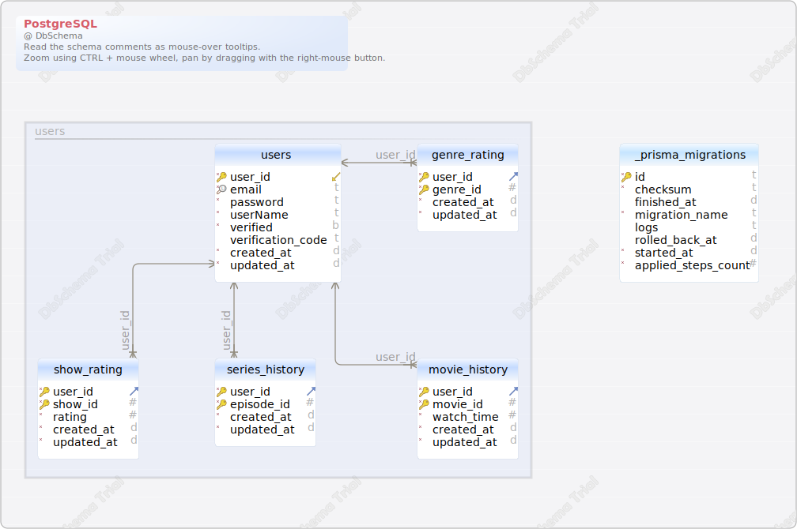

#PostgreSQL
Generated using [DbSchema](https://dbschema.com)

<a name='layout1'>### Main Layout

### Table _prisma_migrations 
| Idx | Field Name | Data Type |
|---|---|---|
| *🔑 | <a name='public._prisma_migrations_id'>id</a>| varchar&#40;36&#41;  |
| *| <a name='public._prisma_migrations_checksum'>checksum</a>| varchar&#40;64&#41;  |
|  | <a name='public._prisma_migrations_finished_at'>finished&#95;at</a>| timestamptz  |
| *| <a name='public._prisma_migrations_migration_name'>migration&#95;name</a>| varchar&#40;255&#41;  |
|  | <a name='public._prisma_migrations_logs'>logs</a>| text  |
|  | <a name='public._prisma_migrations_rolled_back_at'>rolled&#95;back&#95;at</a>| timestamptz  |
| *| <a name='public._prisma_migrations_started_at'>started&#95;at</a>| timestamptz  DEFAULT now() |
| *| <a name='public._prisma_migrations_applied_steps_count'>applied&#95;steps&#95;count</a>| integer  DEFAULT 0 |
| Indexes |
| 🔑 | &#95;prisma&#95;migrations&#95;pkey || ON id|

### Table genre_rating 
| Idx | Field Name | Data Type |
|---|---|---|
| *🔑 ⬈ | <a name='public.genre_rating_user_id'>user&#95;id</a>| integer  |
| *🔑 | <a name='public.genre_rating_genre_id'>genre&#95;id</a>| integer  |
| *| <a name='public.genre_rating_created_at'>created&#95;at</a>| timestamp&#40;3&#41;  DEFAULT CURRENT_TIMESTAMP |
| *| <a name='public.genre_rating_updated_at'>updated&#95;at</a>| timestamp&#40;3&#41;  |
| Indexes |
| 🔑 | genre&#95;rating&#95;pkey || ON genre&#95;id&#44; user&#95;id|
| Foreign Keys |
|  | genre_rating_user_id_fkey | ( user&#95;id ) ref [public&#46;users](#users) (user&#95;id) |

### Table movie_history 
| Idx | Field Name | Data Type |
|---|---|---|
| *🔑 ⬈ | <a name='public.movie_history_user_id'>user&#95;id</a>| integer  |
| *🔑 | <a name='public.movie_history_movie_id'>movie&#95;id</a>| integer  |
| *| <a name='public.movie_history_watch_time'>watch&#95;time</a>| integer  DEFAULT 0 |
| *| <a name='public.movie_history_created_at'>created&#95;at</a>| timestamp&#40;3&#41;  DEFAULT CURRENT_TIMESTAMP |
| *| <a name='public.movie_history_updated_at'>updated&#95;at</a>| timestamp&#40;3&#41;  |
| Indexes |
| 🔑 | movie&#95;history&#95;pkey || ON movie&#95;id&#44; user&#95;id|
| Foreign Keys |
|  | movie_history_user_id_fkey | ( user&#95;id ) ref [public&#46;users](#users) (user&#95;id) |

### Table series_history 
| Idx | Field Name | Data Type |
|---|---|---|
| *🔑 ⬈ | <a name='public.series_history_user_id'>user&#95;id</a>| integer  |
| *🔑 | <a name='public.series_history_episode_id'>episode&#95;id</a>| integer  |
| *| <a name='public.series_history_created_at'>created&#95;at</a>| timestamp&#40;3&#41;  DEFAULT CURRENT_TIMESTAMP |
| *| <a name='public.series_history_updated_at'>updated&#95;at</a>| timestamp&#40;3&#41;  |
| Indexes |
| 🔑 | series&#95;history&#95;pkey || ON episode&#95;id&#44; user&#95;id|
| Foreign Keys |
|  | series_history_user_id_fkey | ( user&#95;id ) ref [public&#46;users](#users) (user&#95;id) |

### Table show_rating 
| Idx | Field Name | Data Type |
|---|---|---|
| *🔑 ⬈ | <a name='public.show_rating_user_id'>user&#95;id</a>| integer  |
| *🔑 | <a name='public.show_rating_show_id'>show&#95;id</a>| integer  |
| *| <a name='public.show_rating_rating'>rating</a>| integer  |
| *| <a name='public.show_rating_created_at'>created&#95;at</a>| timestamp&#40;3&#41;  DEFAULT CURRENT_TIMESTAMP |
| *| <a name='public.show_rating_updated_at'>updated&#95;at</a>| timestamp&#40;3&#41;  |
| Indexes |
| 🔑 | show&#95;rating&#95;pkey || ON user&#95;id&#44; show&#95;id|
| Foreign Keys |
|  | show_rating_user_id_fkey | ( user&#95;id ) ref [public&#46;users](#users) (user&#95;id) |

### Table users 
| Idx | Field Name | Data Type |
|---|---|---|
| *🔑 ⬋ | <a name='public.users_user_id'>user&#95;id</a>| integer  DEFAULT nextval('users_user_id_seq'::regclass) |
| *🔍 | <a name='public.users_email'>email</a>| varchar&#40;480&#41;  |
| *| <a name='public.users_password'>password</a>| varchar&#40;400&#41;  |
| *| <a name='public.users_userName'>userName</a>| text  |
| *| <a name='public.users_verified'>verified</a>| boolean  DEFAULT false |
|  | <a name='public.users_verification_code'>verification&#95;code</a>| varchar&#40;100&#41;  |
| *| <a name='public.users_created_at'>created&#95;at</a>| timestamp&#40;3&#41;  DEFAULT CURRENT_TIMESTAMP |
| *| <a name='public.users_updated_at'>updated&#95;at</a>| timestamp&#40;3&#41;  |
| Indexes |
| 🔑 | users&#95;pkey || ON user&#95;id|
| 🔍  | users&#95;email&#95;key || ON email|

